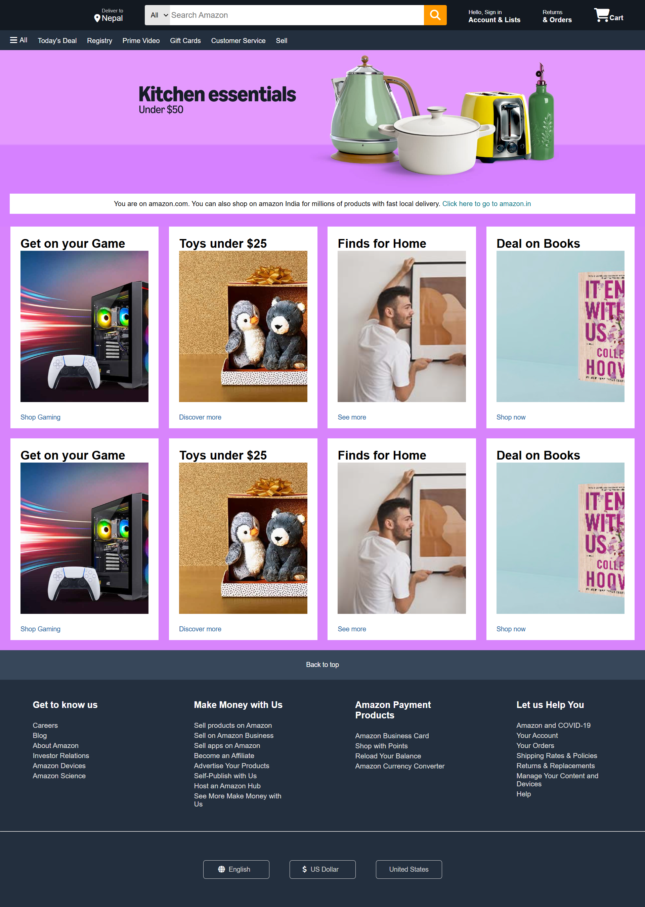

# Amazon Mini Clone

This is a basic clone of the Amazon home page built using only HTML and CSS.

## Features

- Static layout resembling Amazon's homepage
- Includes navbar, banner, and product sections
- Clean and simple structure for practice
- Great for HTML & CSS beginners

## Limitations

- Not responsive
- No interactivity or JavaScript functionality
- Only home screen included

## How to Use

1. Download or clone the repository.
2. Open `index.html` in your browser.

## Screenshot

## Author

Created by voidoku

---

Feel free to customize it with links, screenshots, or more sections like "Inspiration" or "Future Plans" if you want. Let me know if you want a version with Markdown styling previewed.
